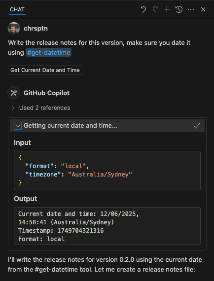

# Get DateTime Extension for VS Code

Provides GitHub Copilot with real-time date and time context.

## Overview

The Get DateTime extension integrates with GitHub Copilot to supply accurate, real-time date and time information. This enables Copilot to use current temporal data for tasks involving scheduling, timestamps, or timezone-specific queries.



### Install from VSIX

1. Download the latest `.vsix` file (e.g., `get-datetime-0.2.0.vsix`).
2. In VS Code: Extensions view > "..." menu > "Install from VSIX...".
3. Select the downloaded `.vsix` file.

## Configuration (Optional)

The extension functions without configuration. To set preferred defaults, modify VS Code settings:

- **`getDateTime.defaultTimezone`**: Specify a default IANA timezone ID (e.g., "America/New_York", "Europe/London", "Australia/Sydney"). If empty, system timezone is used.
  ```json
  "getDateTime.defaultTimezone": "Australia/Sydney"
  ```
- **`getDateTime.defaultLocale`**: Specify a default BCP 47 language tag for formatting (e.g., "en-US", "en-GB", "fr-FR"). If empty, system locale is used.
  ```json
  "getDateTime.defaultLocale": "en-AU"
  ```

**Example `settings.json`:**

```json
{
  "getDateTime.defaultTimezone": "America/New_York",
  "getDateTime.defaultLocale": "en-US"
}
```

## Direct Tool Reference (Advanced):

If needed, explicitly invoke the tool:

```
"Use #get-datetime to show the current time in ISO format."
"Check #get-datetime for the Unix timestamp and create a log entry."
```

## Supported Formats

| Format      | Description                  | Example Output                  |
| ----------- | ---------------------------- | ------------------------------- |
| `local`     | System's local date/time     | `12/06/2025, 5:00:35 PM`        |
| `iso`       | ISO 8601 (UTC)               | `2025-06-12T07:00:35.123Z`      |
| `utc`       | UTC string                   | `Thu, 12 Jun 2025 07:00:35 GMT` |
| `timestamp` | Unix timestamp (ms)          | `1749711635123`                 |
| `relative`  | Human-readable relative time | `just now`                      |

## Troubleshooting

- **Extension Not Active**: Ensure "Get DateTime" is enabled in the Extensions view. Restart VS Code if necessary. Verify GitHub Copilot extension is also active.
- **Incorrect Timezone**: Confirm system timezone is correct. Use `getDateTime.defaultTimezone` setting for overrides. Ensure valid IANA timezone identifiers are used.

## Version History

### 0.2.1 (Current)

- Added extension icon.
- Updated README with improved user-focused content, structure, and a screenshot.
- Minor internal improvements and build process updates.

### 0.2.0

- Added user settings for default timezone and locale.
- Uses system locale by default if no override is set.
- Minor updates to confirmation messages.

### 0.1.0

- Initial release.
- Core functionality for date/time retrieval via GitHub Copilot.
- Support for multiple formats and timezones.

---

Keywords: datetime, time, date, timezone, copilot, context, tool, scheduling, timestamps
